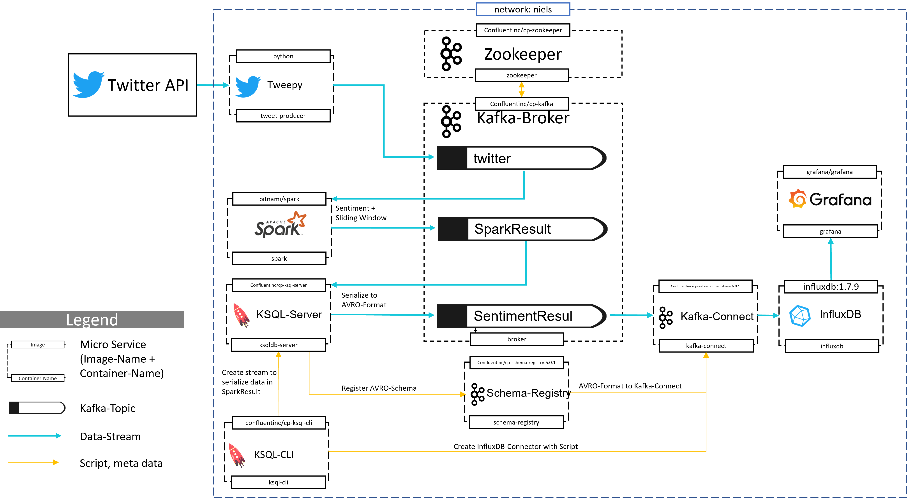

# Twitter Sentiment Analysis

## Introduction

Ludwig Erhard said the economy is to 50% psychology (Erhard, 2021). An excellent example of this quote is the valuation of Bitcoin. In contrast to companies, Bitcoin is not generating goods or services and the evaluation is mainly depended on the estimation how much value the other market participants attach to Bitcoin and thus how much demand emerges (Bloomenthal 2021). With the development and the widespread adaption of social media new possibilities arose to estimate the opinion of interested person groups on Bitcoin measured by a sentiment index. 

The goal of this project is to visualize a calculated sentiment-index of tweets containing the word Bitcoin in near-real-time. A microservice architecture is used (attached). The data is ingested via a python container to a Kafka Container from the Twitter-API (tweepy filters tweets with the word Bitocin, JSON operations select the necessary information from each tweet). The tweets are consumed and processed with Spark, a UDF calculates the sentiment of each tweet with Afinn  (Nielsen, n.a.). And an average sentiment-index is calculated as a sliding window of the last 3 minutes, generated every 20 seconds. This data stream is feed to Kafka again, KSQL serialize the Data to AVRO-Format and Kafka-Connect ingest the data to an InfluxDB sink. Grafana visualize the sentiment index as a time series from InfluxDB. Kafka, Spark, and InfluxDB can be run as distributed systems to ensure scalability and are proven as highly reliable (distributed systems, widespread adoption). The complete infrastructure to calculate and visualize the sentiment-index shall be started with one line of code by using docker-compose. The dashboards and data source connection of Grafana shall be provisioned automated. Docker-compose assures easy maintainability of the big data architecture.  Secure access to Twitter-API with OAuthHandler and access tokens. Kafka, Spark and Influxdb and Grafana can be set up with securities protocols like SSL to ensure the protection of the system. 

## Architecture
The architecture is depicted in the following graph: 

## Prerequisits
* Docker-Compose is installed (if not look [here](https://docs.docker.com/compose/install/ "Docker Homepage))
* Ubunto Environment (if not install Virtual Box with Ubuntu, look [here](https://www.heise.de/tipps-tricks/Ubuntu-in-VirtualBox-nutzen-so-klappt-s-4203333.html "Heise"))
* 10 GB RAM available
* Git is installed (if not, look [here]) 

## Getting Starting
First step is to clone the Repository
Create a new directory and enter in the a Terminal: 
git clone "<path to this directory>" 

## Library: 
* Bloomenthal, A., 2021, What Determines the Price of 1 Bitcoin?, https://www.investopedia.com/tech/what-determines-value-1-bitcoin/ last access 27.07.2021 at 13:13
* Kumar, A., Garg, G., 2019, Sentiment analysis of multimodal twitter data, Multimedia Tools and Applications (2019) 78:24103-24119, https://link.springer.com/article/10.1007/s11042-019-7390-1 last access 27.07.2021 at 13:30 
* Erhard, L. (2021), Zitate von Ludwig Erhard, https://www.zitate.eu/autor/ludwig-erhard-zitate/191304 last access 27.07.2021 at 16:47
* Nielsen, F. n.a., A new ANEW: Evaluation of a word list for sentiment analysis in microblogs, DTU Informatics, Technical University of Denmark, Lyngby, Denmark
