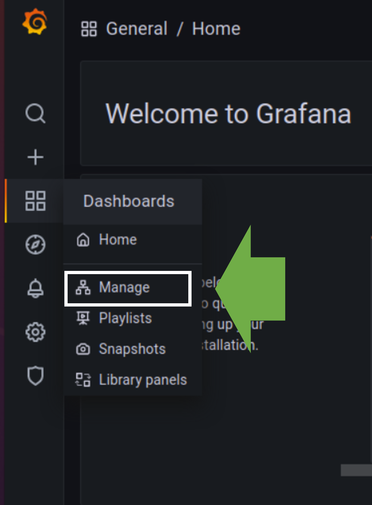
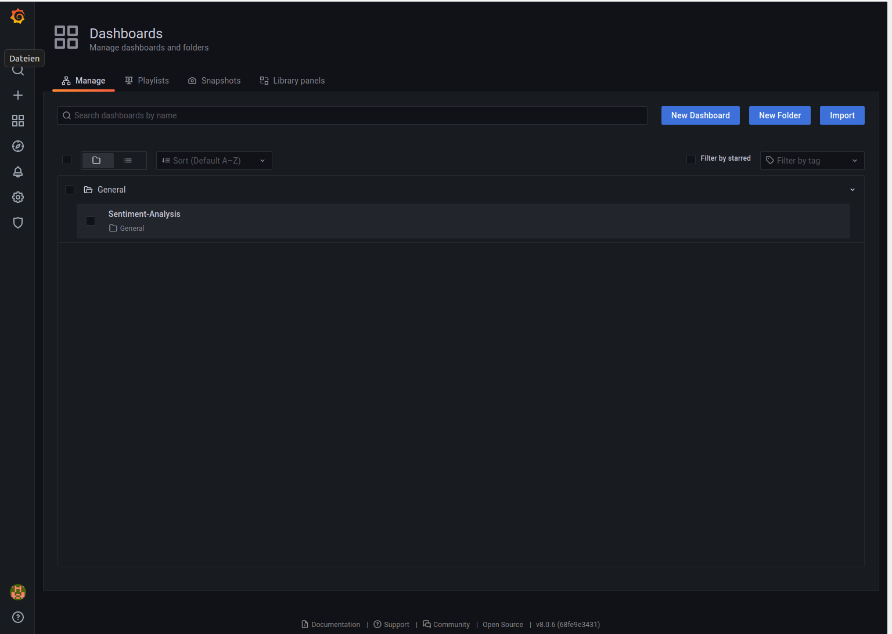

# Twitter Sentiment Analysis

## Introduction

Ludwig Erhard said the economy is to 50% psychology (Erhard, 2021). An excellent example of this quote is the valuation of Bitcoin. In contrast to Bitcoin, companies produce goods and services and generating cashflows. The value of the company can be assessed e.g. with the discounted cashflow model. Bitcoins on the other hand does not produce goods or services and neither cashflows. The valuation is mainly depended on the estimation on how much value the other market participants attach to Bitcoin and thus how much demand emerges (Bloomenthal 2021). With the development and the widespread adaption of social media new possibilities arose to estimate the opinion of interested person groups on Bitcoin measured by a sentiment index. This sentiment index can be a good indicator to assess the demand for Bitcoin.


The goal of this project is to visualize a calculated sentiment-index of tweets containing the word Bitcoin in near-real-time. A microservice architecture is used (see below). The data is ingested from the Twitter-API to a Kafka Container via a Python container running Tweepy and Pykafka (Tweepy filters tweets with the word Bitcoin, JSON operations select the necessary information from each tweet and Pykafka produces this data to a Kafka topic). The tweets are consumed and processed with Spark. For each tweet a sentiment score is calculated with a UDF and the python library Afinn  (Nielsen, n.a.) and an average sentiment-index is calculated as a sliding window of the last 1 minutes, generated every 20 seconds. This data stream is feed to a Kafka topic again, KSQL serialize the Data to AVRO-Format and Kafka-Connect ingest the data to an InfluxDB sink. Grafana visualize the sentiment index as a time series from InfluxDB. Kafka, Spark, and InfluxDB can be run as distributed systems to ensure scalability. Those components are proven as highly reliable (distributed systems, widespread adoption, fault tolerant e.g. offsets). The complete infrastructure to calculate and visualize the sentiment-index can be started with one line of code by using docker-compose. The dashboards and data source connection of Grafana are provided automated. Docker-compose assures easy maintainability of the big data architecture.  Secure access to Twitter-API with OAuthHandler and access tokens are needed. Kafka, Spark, Influxdb and Grafana can be set up with securities protocols like SSL to ensure the protection of the system. The Tweets consumed are publicity available and thus the information is not confidential and may not violate e.g. GDPR rules. The chosen governance policy is focusing on policies, standards, and strategies. Kafka Schema Registry, Kafka Connect and KSQLDB assuring a standardization of output data. The chosen approach enables further standardized extension with Kafka as the backbone of the big data application.


## Architecture
The architecture is depicted in the following graph: 


## Prerequisits
* Docker-Compose is installed (if not, look [here](https://docs.docker.com/compose/install/ "Docker Homepage"))
* Ubuntu Environment (if not, install Virtual Box with Ubuntu, look [here](https://www.heise.de/tipps-tricks/Ubuntu-in-VirtualBox-nutzen-so-klappt-s-4203333.html "Heise"))
* 10 GB RAM available
* Git is installed (if not, look [here](https://git-scm.com/book/en/v2/Getting-Started-Installing-Git "GIT")) 
* Twitter account and access token (if not, look [here](https://developer.twitter.com/ja/docs/basics/authentication/guides/access-tokens "TWITTER"))


# Run the application
First step is to clone the repository

Create a new directory and enter in a Terminal: 

```bash
git clone "<path to this repository>" 
```
Configure the TweetProducer config.ini in the folder ./TweetProducer file: 
* Enter our Twitter Credentials here: 
```bash
[AUTH]
consumer_key=
consumer_secret=
access_token=
access_secret=
```
No quotation marks are needed.

* Specify the buzz word for searching Tweets. In our case Bitcoin: 
```bash 
[TOPIC]
topic=Bitcoin
```

Start the applications with the following command:

```bash 
sudo docker-compose up
```
* And wait up to 5 Minutes (if images does not exist it may take a while ⏳......)

* Open a web browser and enter localhost:3000 enter for Username "admin" and for Password "admin"

* Choose a new Password in the following page 

* If everythings runs smoothly the datasource and the dashboard are already provisioned and you see following screen: 

* To get to the provided Dashboard click on the left menu bar click "Dashboards" --> "Manage"

* Click on Sentiment-Analysis: 


# Step by Step Explination

## Docker-Compose

The whole application is specified in a docker-compose file and can be started with one line of code.

## Kafk Zookeeper & Broker
The Kafka Zookeeper and Broker are the backbone of this big data application. Both application are running in a separated container. 
Kafka Broker works as a publish subscriber system. Data can be ingested to a specified topic and from this topic other application can consume the data.

## TweetProducer
TweetProducer streams tweets from the Twitter-API with the library tweepy to a Kafka topic with library pykafka. 
Tweepy filters the tweets with the following two criterias: 
* Lenguage: English
* Topic: The Topic sppecified in the config.ini file ( in our case "Bitcoin")
```bash
#Filter to the search word (e.g. Bitcoin) and sorting for english messages
	twitter_stream.filter(languages=['en'], track=[word])
```
With simple JSON Operations the most important information are preselected to be streamed to a Kafka Topic. The text of the stream is shown in the console:

```bash
json_data = json.loads(data)
			send_data = '{}'
			json_send_data = json.loads(send_data)			
			json_send_data['text'] = json_data['text']
			json_send_data['created_at']= json_data['created_at']
			json_send_data_user=json_data['user']
			json_send_data["id"]=json_send_data_user["id"]
			json_send_data["followers_count"]=json_send_data_user["followers_count"]
			print(json_send_data['text'], "___________END_____________")
			self.producer.produce(bytes(json.dumps(json_send_data),'ascii'))
```

The TweetProducer runs in a normal python container as a microservice. The image is build during the docker-compose process.
If the TweetProducer is working correctly it produces logs entries with the text of streamed tweets. The logs can be viewed as follows: 
```bash
sudo docker logs tweet-producer
```
It should look like: 
```bash
Another+30k #Bitcoin off the market! 🙌 🚀 ___________END_____________
```
Check whether the tweets are inegsted to the Kafka topic twitter correctly: 
```bash
sudo docker exec -it broker bash
kafka-console-consumer --bootstrap-server localhost:19092 --topic twitter
```
It should look like: 
 ```bash
{"text": "RT @BenCaselin: Quite exciting to see this in the @SCMPHongKong on behalf of @AAXExchange to provide some clarity in the crypto madness wit\u2026", "created_at": "Wed Jul 28 10:35:09 +0000 2021", "id": 1159245658521423873, "followers_count": 780}
```

Note: Sometimes the container crashes in the very beginning since no Kafka Broker is available in the first seconds. To avoid long waiting times the container always will restart after crash... thus the container crashes and restarts till a Kafka Broker is available.

## Spark Structures Streaming 
Spark is a big data application for batch as well as stream processing. In our case we use Spark to process the stream of data (Structured Streaming): 
* Add for each Tweet a Sentiment Score with a user defined function and the python library Afinn 

* Calculate the Sentiment index as an average value in a 1 minute window each 20 Seconds. 

* The sentiment-index is ingested back again to the Kafka topic "SparkResult" 

To check whether the application runs smoothly, check the following: 
```bash
sudo docker exec -it broker bash
kafka-console-consumer --bootstrap-server localhost:19092 --topic SparkResult
```
The output should look like:
```bash
{"end":"2021-07-28T10:38:00.000Z","UNIX_TIMESTAMP":1627468680,"AVG_Sentiment":1.0256410256410255,"key":2}
```
The spark application runs in a own container in single mode.

## KSQLDB-Server, KSQL-CLI, Kafka Schema-Registry

In order to save the time series data (the Sentiment-Index ingested to Kafka from Spark) to the database InfluxDB, the data needs to be serialized to a AVRO-Format with a KSQLDB-Server. The KSQL-CLI is used to pass a script to the KSQLDB-Server in order to create a Stream to serialize the data in SparkResult. The commands to create a Stream reading from the Topic SparkResult, serializing the data to AVRO-Format and ingesting the serialized data back again into the a new topic called SentimentResult are the following: 
```bash
CREATE STREAM To_INFLUX (UNIX_TIMESTAMP bigint, AVG_SENTIMENT DOUBLE) WITH (KAFKA_TOPIC='SparkResult', VALUE_FORMAT='JSON');
CREATE STREAM TO_INFLUX_AVRO WITH (VALUE_FORMAT='AVRO', KAFKA_TOPIC='SentimentResult') AS SELECT * FROM To_INFLUX;
```
To check whether the KSQLDB Stream is created: 
```bash
sudo docker logs ksql-cli
```
If the container are created newly and no data is saved locally the output schoud look like: 
```bash
ksql> ksql> CREATE STREAM To_INFLUX (UNIX_TIMESTAMP bigint, AVG_SENTIMENT DOUBLE) WITH (KAFKA_TOPIC='SparkResult', VALUE_FORMAT='JSON')
 Message        

 Stream created 

ksql> CREATE STREAM TO_INFLUX_AVRO WITH (VALUE_FORMAT='AVRO', KAFKA_TOPIC='SentimentResult')
 Message                                                                                          

 Stream TO_INFLUX_AVRO created and running. Created by query with query ID: CSAS_TO_INFLUX_AVRO_2
 ```
If the container already exists: 
```bash
ksql> ksql> CREATE STREAM To_INFLUX (UNIX_TIMESTAMP bigint, AVG_SENTIMENT DOUBLE) WITH (KAFKA_TOPIC='SparkResult', VALUE_FORMAT='JSON')Cannot add stream 'TO_INFLUX': A stream with the same name already exists
ksql> CREATE STREAM TO_INFLUX_AVRO WITH (VALUE_FORMAT='AVRO', KAFKA_TOPIC='SentimentResult')
 Message                                                                                          

 Stream TO_INFLUX_AVRO created and running. Created by query with query ID: CSAS_TO_INFLUX_AVRO_4
```

The KSQLDB-Server can create a Kaka-Connector to the InfluxDb as well.
Check whether the connector is active: 
```bash
sudo docker exec -it ksqldb-server ksql

SHOW CONNECTORS;
```
The Output should look like: 
```bash
Connector Name        | Type | Class                                       
----------------------------------------------------------------------------
 SINK_INFLUX_EVENTTIME | SINK | io.confluent.influxdb.InfluxDBSinkConnector 
----------------------------------------------------------------------------
```
Check whether the data stream is ingested in the Kafka Topic SentimentResult correctly: 
```bash
sudo docker exec -it ksqldb-server ksql
PRINT "SentimentResult";
```
The result should look like: 
```bash
Format:AVRO
7/28/21 10:53:53 AM UTC, 2, {"UNIX_TIMESTAMP": 1627469620, "AVG_SENTIMENT": 1.4357541899441342}
7/28/21 10:53:58 AM UTC, 2, {"UNIX_TIMESTAMP": 1627469640, "AVG_SENTIMENT": 1.3597122302158273}
```

Ksqldb-server as well as ksql-cli runs in seperated containers. 

The Kafka schema registry saves the data format of data stored in Kafka Topics if serilized. The schema registry passes the information to Kafka-Connect when ingesting data to the InfluxDB sink.

## Kafka-Connect
Kafka-Connect connects the Kafka topic Sentiment Result to the InfluxDB Database. 

The connector needs to be installed befor running. The installation is spcified in the docker-compose file 
```bash
kafka-connect: 
    .......
    command: bash -c "
                confluent-hub install --no-prompt confluentinc/kafka-connect-influxdb:latest
```
To check whether the connector exists, enter in the terminal the following REST API command: 
```bash
curl -s localhost:8083/connector-plugins|jq '.[].class'
```
The result should look like: 
```bash
"io.confluent.influxdb.InfluxDBSinkConnector"
"io.confluent.influxdb.source.InfluxdbSourceConnector"
```
To check whether the Connector works fine, pass the following REST API command in the terminal
```bash
curl -s "http://localhost:8083/connectors?expand=info&expand=status" | \
       jq '. | to_entries[] | [ .value.info.type, .key, .value.status.connector.state,.value.status.tasks[].state,.value.info.config."connector.class"]|join(":|:")' | \
       column -s : -t| sed 's/\"//g'| sort
```
The Result should look like: 
```bash
sink  |  SINK_INFLUX_EVENTTIME  |  RUNNING  |  RUNNING  |  io.confluent.influxdb.InfluxDBSinkConnector 
```
It should display two times RUNNING. Otherwise the Connector is failing....

## InfluxDB
InfluxDB is a database opimized for time series like the Sentiment Index. 

To check whether the sentiment-index is ingested in InfluxDB correctly, do the following: 
```bash
sudo docker exec -it influxdb influx
SHOW DATABASES;
```
Output should look like: 
```bash
name: databases
name
----
_internal
influxSentiment
```
Enter in the command line: 
```bash
USE influxSentiment;
SELECT * FROM SentimentResult;
```
The output should look like: 
```bash
name: SentimentResult
time                AVG_SENTIMENT
----                -------------
1627465060000000000 1.6094674556213018
1627465080000000000 1.4395604395604396
```
## Grafana
The Datasource and the Dashboards are provisioned automated:

* ./grafana/config.ini defines the path to the datasource and dashboard configurations
* the configuration files are mounted in the grafana container 

If the Datasources are not provioned correctly. You can configure the datasource as follows: 


* Password is specified in Dockerfiles: CHANGEME
* Test the Datasource with the Button "Test"

## Network 
All container are connected via a created network called "niels"

## Possible Errors: 
* Topic SparkResult is not created when KSQLDB creates stream for serialize data --> Strem will not be created. Solution run the system for 5 minutes than enter sudo docker-compose down and rerun with sudo docker-compose up. Topic SparkResult is already created and stream to serialize data can be created without error.  

## Limitations: 
* One Kafka-broker and one Spark-container are applied to cope with limited computer resources (easy to extend to a distributed system). InfluxDB in distributed mode is not for free. 
* Just text sentiment analysis is applied. Pictures and emojis are not considered (Kuma A., 2019)
* Twitter data can be biased and not representative 
* Kafka, Spark and InfluxDB are not secured with SSL in this project. Deployment in production required installation of security protocols like SSL. 

## Lessons Learned
* Use Git Version Control from the very beginning 
* Pay attention to the format of the data stream from the source, the errors are mostly likely to occur in the end and to solve them costs a lot of time (like serialize the data stream with ksqldb to be able to be ingested the data into the InfluxDB sink)
* The next time I would use the Twitter Source Connector from JCustenborder [here](https://github.com/jcustenborder/kafka-connect-twitter "GITHUB") 

## Library: 
* Bloomenthal, A., 2021, What Determines the Price of 1 Bitcoin?, https://www.investopedia.com/tech/what-determines-value-1-bitcoin/ last access 27.07.2021 at 13:13
* Kumar, A., Garg, G., 2019, Sentiment analysis of multimodal twitter data, Multimedia Tools and Applications (2019) 78:24103-24119, https://link.springer.com/article/10.1007/s11042-019-7390-1 last access 27.07.2021 at 13:30 
* Erhard, L. (2021), Zitate von Ludwig Erhard, https://www.zitate.eu/autor/ludwig-erhard-zitate/191304 last access 27.07.2021 at 16:47
* Nielsen, F. n.a., A new ANEW: Evaluation of a word list for sentiment analysis in microblogs, DTU Informatics, Technical University of Denmark, Lyngby, Denmark
* Blogs from Robin Moffat [here](https://rmoff.net/)
